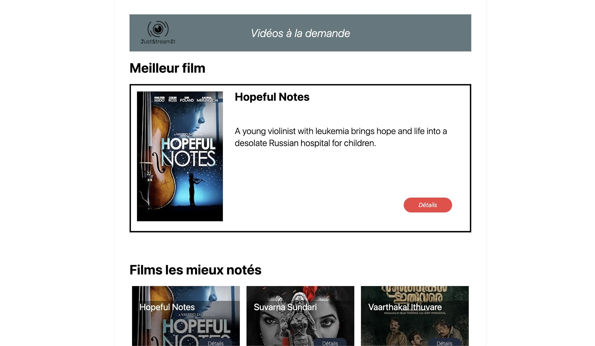

# Just Stream It



## About the project

This project is designed to interact with the OCMovies REST API, which provides access to a comprehensive catalog of movies. Our goal is to use this API to create an interactive website where users can browse and explore various movies, view detailed information, and discover new titles.


## Built With

* 
* 
* CSS made with  

## Getting Started

### Prerequisites

Install OCMovies API.

Follow this link and follow the installation steps : [API Link](https://github.com/OpenClassrooms-Student-Center/OCMovies-API-EN-FR)

### Installation

1- Clone the project

```bash
    git clone https://github.com/MaximeLanca/Project_JustStreamIt.git
    cd Project_JustStreamIt
```

2- Install dependencies

```bash
    npm install
```

3- Launch the project

Open the html file in your browser

```bash
    open index.html
```

## What I Learned
Working on this project allowed me to strengthen and expand my web development skills in several areas:

* API Integration
* JavaScript Fundamentals
* integration from a mockup 
* Tailwind CSS
* DOM Manipulation
* Responsive development

This project provided a solid foundation for working with external APIs and reinforced best practices for creating responsive, user-friendly interfaces.

